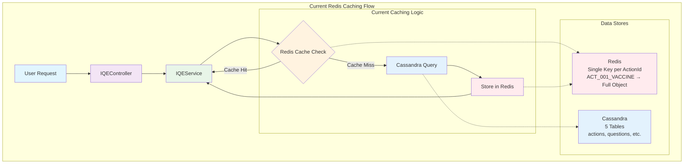
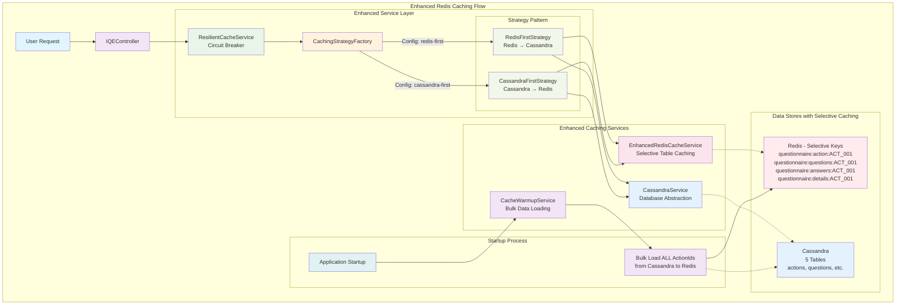
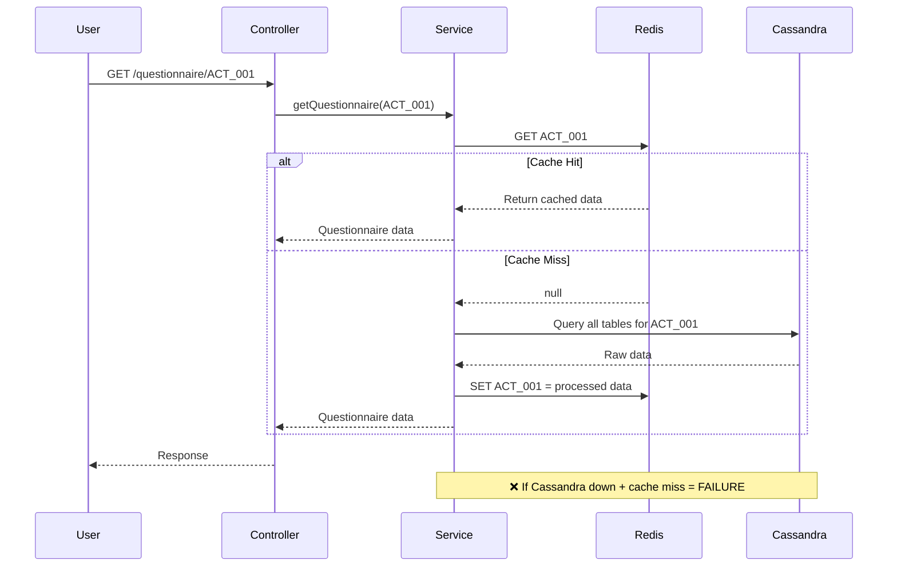
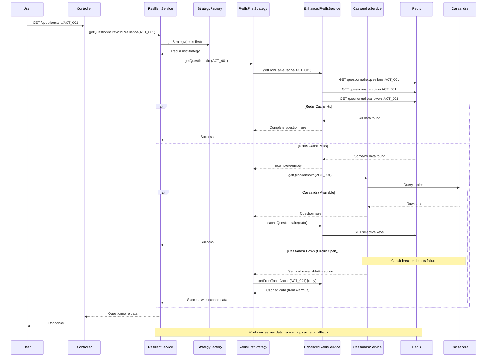

# Redis Caching Strategy: Before vs After Flow Diagrams

## Current Implementation (BEFORE)



### Current Implementation Issues:
- ❌ **Limited Fallback**: Only caches specific actionIds that have been requested
- ❌ **No Complete Data**: If Cassandra is down, new actionIds cannot be retrieved
- ❌ **Single Point of Failure**: No circuit breaker or resilience patterns
- ❌ **Basic Caching**: Simple key-value with no optimization

---

## Proposed Implementation (AFTER)



### Enhanced Implementation Benefits:
- ✅ **Complete Data Availability**: Cache warmup loads ALL actionIds into Redis
- ✅ **Seamless Fallback**: Circuit breaker automatically handles service outages
- ✅ **Configurable Strategies**: Feature flags switch between Redis-first/Cassandra-first
- ✅ **Memory Efficient**: Selective caching with optimized key patterns
- ✅ **High Availability**: Resilient patterns with automatic failover

---

## Detailed Read Flow Comparison

### BEFORE: Simple Cache-Aside Pattern


### AFTER: Resilient Multi-Strategy Pattern


---

## Cache Warmup Process Detail

```mermaid
graph TB
    subgraph "Cache Warmup Flow"
        Start[Application Startup]:::startup
        WarmupService[CacheWarmupService]:::service
        
        subgraph "Bulk Loading Process"
            GetAllActions[Get All ActionIds<br/>from Cassandra]:::query
            BatchProcess[Process in Batches<br/>Size: 50]:::batch
            LoadQuestionnaire[Load Each Questionnaire<br/>from Cassandra]:::load
            CacheSelective[Cache with Selective Keys<br/>questionnaire:*:{actionId}]:::cache
        end
        
        subgraph "Result"
            CompleteCache[Redis Contains<br/>ALL Questionnaire Data]:::result
        end
    end
    
    Start --> WarmupService
    WarmupService --> GetAllActions
    GetAllActions --> BatchProcess
    BatchProcess --> LoadQuestionnaire
    LoadQuestionnaire --> CacheSelective
    CacheSelective --> CompleteCache
    
    classDef startup fill:#e0f2f1
    classDef service fill:#e8f5e8
    classDef query fill:#e3f2fd
    classDef batch fill:#fff3e0
    classDef load fill:#f3e5f5
    classDef cache fill:#ffebee
    classDef result fill:#e1f5fe
```

---

## Key Differences Summary

| Aspect | BEFORE (Current) | AFTER (Proposed) |
|--------|------------------|------------------|
| **Data Availability** | ❌ Only requested actionIds cached | ✅ ALL actionIds cached via warmup |
| **Fallback Strategy** | ❌ Simple cache-aside pattern | ✅ Circuit breaker with resilient fallback |
| **Configuration** | ❌ Static Redis flag | ✅ Dynamic strategy switching |
| **Memory Usage** | ❌ Single large objects per key | ✅ Selective table-level caching |
| **High Availability** | ❌ Fails when Cassandra down | ✅ Serves from Redis cache always |
| **Performance** | ❌ Cold cache performance issues | ✅ Warm cache with sub-ms reads |
| **Monitoring** | ❌ Basic Redis connectivity | ✅ Comprehensive metrics & health checks |

## Configuration Example

```yaml
# BEFORE
service:
  redis-cache:
    redisFlag: false
    cacheType: genericcache_1h_noextend

# AFTER  
service:
  redis-cache:
    enabled: true
    strategy: "redis-first"  # or "cassandra-first"
    table-caching:
      warmup-enabled: true
      warmup-batch-size: 50
    read-optimization:
      prefer-redis: true
      seamless-fallback: true
```

This transformation ensures Redis serves as the primary data store for reads with complete data availability, even when Cassandra is unavailable.
