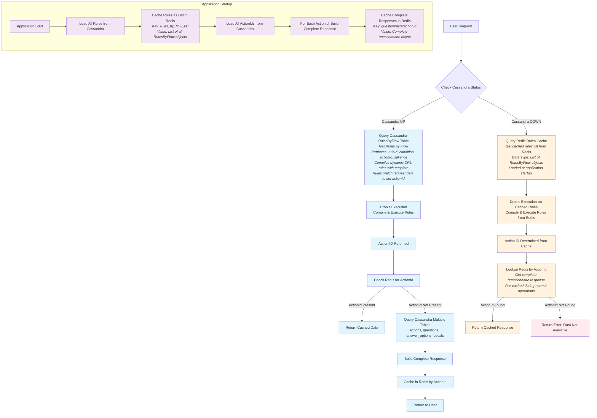

# Updated Redis Fallback Flow Diagram

## Enhanced Flow with Redis Fallback for Cassandra Outages



## Key Implementation Changes Required

### 1. Application Startup Cache Warming
```java
@EventListener(ApplicationReadyEvent.class)
public void warmupRedisCache() {
    // Load all rules into Redis as a list
    List<RulesByFlowEntity> allRules = rulesByFlowRepo.findAll().collectList().block();
    redisTemplate.opsForValue().set("rules_by_flow_list", allRules);
    
    // Load all complete questionnaire responses by actionId
    List<String> allActionIds = actionsRepo.findAllActionIds().collectList().block();
    for (String actionId : allActionIds) {
        QuestionareRequest completeResponse = buildCompleteQuestionnaire(actionId);
        redisTemplate.opsForValue().set("questionnaire:" + actionId, completeResponse);
    }
}
```

### 2. Enhanced Rules Query with Fallback
```java
public Mono<List<RulesByFlowEntity>> getRulesByFlow(String flow) {
    return cassandraHealthCheck()
        .flatMap(isHealthy -> {
            if (isHealthy) {
                // Primary: Query Cassandra
                return rulesByFlowRepo.findByFlow(flow).collectList();
            } else {
                // Fallback: Query Redis cached rules
                List<RulesByFlowEntity> cachedRules = redisTemplate.opsForValue()
                    .get("rules_by_flow_list");
                return Mono.just(cachedRules.stream()
                    .filter(rule -> rule.getFlow().equals(flow))
                    .collect(Collectors.toList()));
            }
        });
}
```

### 3. Complete Response Lookup with Fallback
```java
public Mono<QuestionareRequest> getQuestionnaireByActionId(String actionId) {
    return cassandraHealthCheck()
        .flatMap(isHealthy -> {
            if (isHealthy) {
                // Primary: Build from Cassandra + cache result
                return buildFromCassandra(actionId)
                    .doOnNext(response -> 
                        redisTemplate.opsForValue().set("questionnaire:" + actionId, response));
            } else {
                // Fallback: Get from Redis cache
                QuestionareRequest cachedResponse = redisTemplate.opsForValue()
                    .get("questionnaire:" + actionId);
                return cachedResponse != null ? 
                    Mono.just(cachedResponse) : 
                    Mono.error(new ServiceUnavailableException("Data not available"));
            }
        });
}
```

## Redis Data Structure

### Rules Cache
```
Key: "rules_by_flow_list"
Type: List
Value: [
  {
    "ruleId": "rule1",
    "flow": "VACCINE", 
    "condition": "requiredQuestionnaireContext==\"MC_VACCINE_PATIENT_PROFILE_INFO\"",
    "actionId": "15829236-712a-4b0f-ae71-efeccc1ed924",
    "salience": 100
  },
  // ... more rules
]
```

### Complete Questionnaire Cache
```
Key: "questionnaire:15829236-712a-4b0f-ae71-efeccc1ed924"
Type: Object
Value: {
  "actions": { "questionIds": ["race", "ethnicity"] },
  "questions": [
    {
      "questionId": "race",
      "text": "What's your race?",
      "answerOptions": [...]
    }
  ],
  "details": {...}
}
```

## Benefits of This Approach

1. **Complete Fallback**: When Cassandra is down, entire flow works from Redis
2. **Rules Engine Compatibility**: Drools can execute rules from cached data
3. **Performance**: Pre-cached complete responses for instant serving
4. **Startup Warming**: All data loaded into Redis at application start
5. **Graceful Degradation**: Clear error handling when data unavailable

## Implementation Priority

1. **Phase 1**: Implement cache warming at application startup
2. **Phase 2**: Add Cassandra health checks and fallback logic
3. **Phase 3**: Update existing services to use fallback pattern
4. **Phase 4**: Add monitoring and alerting for fallback scenarios
